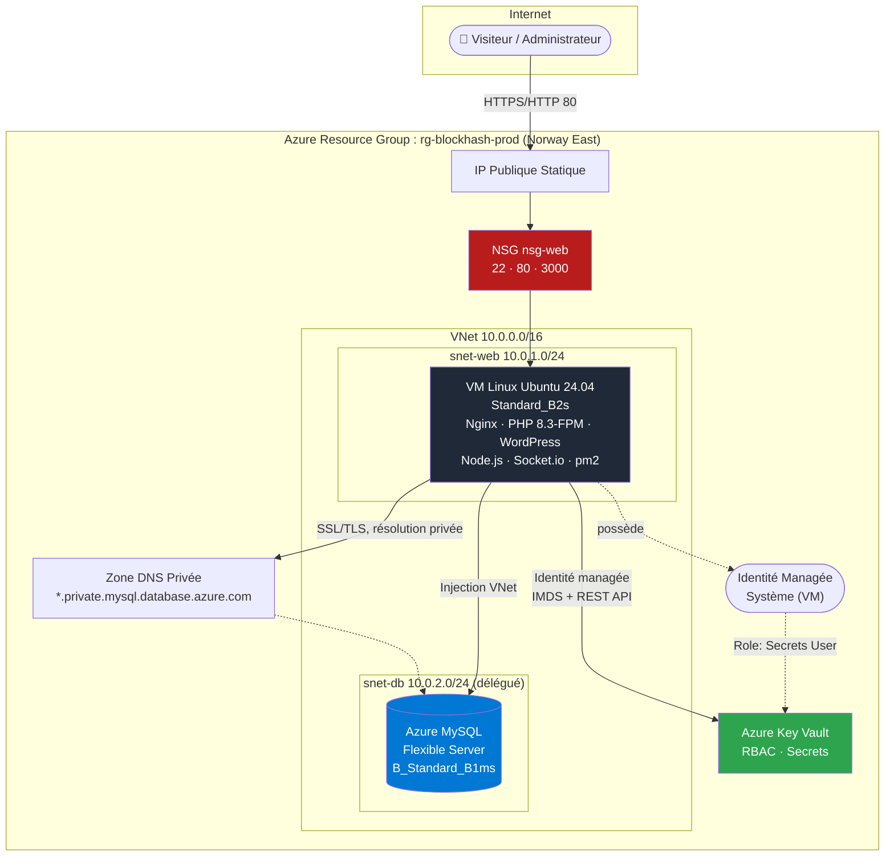
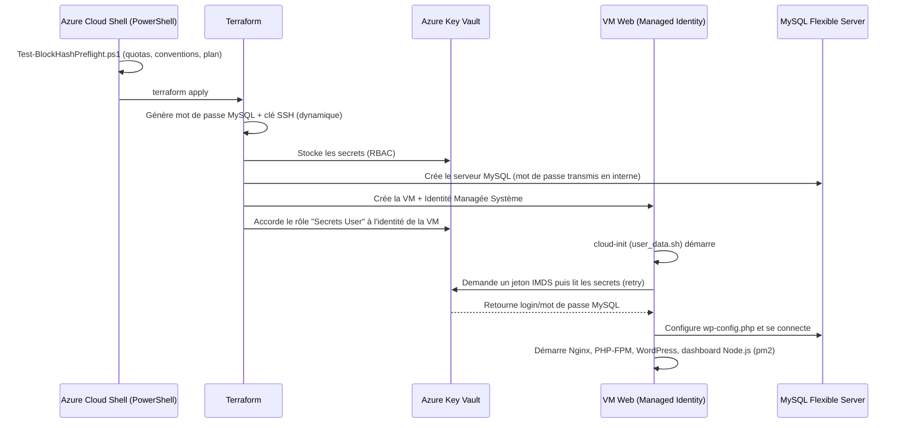
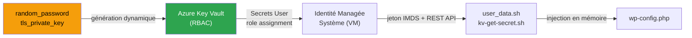

<div align="center">

#  BlockHash - Azure Cloud Infrastructure

### Infrastructure-as-Code modulaire pour un socle WordPress haute-observabilité sur Microsoft Azure

[](https://developer.hashicorp.com/terraform)
[](https://azure.microsoft.com/)
[](https://registry.terraform.io/providers/hashicorp/azurerm/latest)
[]()
[]()
[]()

**[Vue d'ensemble](#-vue-densemble) • [Architecture](#-architecture) • [Stack technique](#-stack-technique) • [Démarrage rapide](#-démarrage-rapide) • [Configuration](#-référence-des-variables) • [Sécurité](#-sécurité--gestion-des-secrets) • [Observabilité](#-observabilité--monitoring) • [FAQ](#-questions-fréquentes--dépannage)**

</div>

---

##  Sommaire

- [Vue d'ensemble](#-vue-densemble)
- [Architecture](#-architecture)
- [Stack technique](#-stack-technique)
- [Structure du dépôt](#-structure-du-dépôt)
- [Prérequis](#-prérequis)
- [Démarrage rapide](#-démarrage-rapide)
- [Référence des variables](#-référence-des-variables)
- [Sécurité & gestion des secrets](#-sécurité--gestion-des-secrets)
- [Observabilité & Monitoring](#-observabilité--monitoring)
- [Ressources Azure provisionnées](#-ressources-azure-provisionnées)
- [Sorties Terraform (outputs)](#-sorties-terraform-outputs)
- [Estimation des coûts](#-estimation-des-coûts)
- [Cycle de vie & opérations](#-cycle-de-vie--opérations)
- [Questions fréquentes / Dépannage](#-questions-fréquentes--dépannage)
- [Feuille de route](#-feuille-de-route)
- [Bonnes pratiques appliquées](#-bonnes-pratiques-appliquées)
- [Licence & contact](#-licence--contact)

---

##  Vue d'ensemble

**BlockHash** est un projet d'infrastructure cloud **100 % as-code**, conçu pour déployer et exploiter un socle applicatif **WordPress** sur **Microsoft Azure**, accompagné d'un **dashboard de monitoring temps réel** développé sur-mesure.

Le projet répond à quatre exigences fondamentales :

| Exigence | Réponse apportée |
|---|---|
| **Reproductibilité** | Infrastructure entièrement décrite en Terraform, modulaire, versionnable et ré-exécutable à l'identique sur n'importe quel abonnement Azure. |
| **Sécurité par conception** | Aucun secret en dur dans le code : génération dynamique + Azure Key Vault + identité managée (voir [Sécurité](#-sécurité--gestion-des-secrets)). |
| **Observabilité native** | Dashboard temps réel (WebSocket) + monitoring système/applicatif avec alerting automatique (Discord/Slack/Email). |
| **Gouvernance du déploiement** | Script de pré-validation PowerShell exécutable dans Azure Cloud Shell, contrôlant quotas, conventions et cohérence Terraform **avant** tout déploiement. |

### Cas d'usage cible

Un site WordPress de production, hébergé sur une VM Linux unique, avec base de données managée, supervisé en continu par un dashboard interne exposant en direct la santé applicative (disponibilité HTTP, taux d'erreurs 5xx, CPU/RAM/disque) et les logs Nginx.

---

##  Architecture



### Flux applicatif



---

##  Stack technique

<table>
<tr><th>Couche</th><th>Technologie</th><th>Rôle</th></tr>

<tr><td rowspan="1"><b>Infrastructure as Code</b></td>
<td></td>
<td>Provisioning déclaratif, modulaire (<code>hashicorp/azurerm</code>, <code>random</code>, <code>tls</code>, <code>time</code>)</td></tr>

<tr><td rowspan="4"><b>Cloud Provider</b></td>
<td>Azure Virtual Network</td><td>Segmentation réseau (sous-réseaux Web/DB, NSG)</td></tr>
<tr><td>Azure MySQL Flexible Server</td><td>Base de données managée, injectée VNet, DNS privé</td></tr>
<tr><td>Azure Linux Virtual Machine</td><td>Hôte applicatif (Ubuntu 24.04 LTS)</td></tr>
<tr><td>Azure Key Vault</td><td>Coffre-fort de secrets, RBAC, identité managée</td></tr>

<tr><td rowspan="3"><b>Runtime applicatif</b></td>
<td>Nginx</td><td>Reverse proxy HTTP + terminaison WebSocket</td></tr>
<tr><td>PHP 8.3-FPM</td><td>Exécution WordPress</td></tr>
<tr><td>WordPress (latest)</td><td>CMS applicatif</td></tr>

<tr><td rowspan="4"><b>Dashboard temps réel</b></td>
<td>Node.js + Express</td><td>Serveur backend du dashboard</td></tr>
<tr><td>Socket.io</td><td>Diffusion WebSocket des métriques et logs</td></tr>
<tr><td>pm2</td><td>Supervision et redémarrage automatique du process Node.js</td></tr>
<tr><td>Tailwind CSS · Chart.js · Lucide Icons</td><td>Interface "Dark Glassmorphism" temps réel</td></tr>

<tr><td rowspan="2"><b>Observabilité</b></td>
<td>monitor.sh (Bash + cron)</td><td>Sondes HTTP / 5xx / CPU / RAM / disque, alerting</td></tr>
<tr><td>Discord/Slack Webhook + mailutils</td><td>Canaux de notification d'incident</td></tr>

<tr><td rowspan="1"><b>Gouvernance</b></td>
<td>PowerShell (Az module)</td><td>Pré-validation de déploiement dans Azure Cloud Shell</td></tr>
</table>

---

##  Structure du dépôt

```text
blockhash-azure-infrastructure/
├── main.tf                          # Orchestration des modules
├── variables.tf                     # Variables d'entrée du projet
├── outputs.tf                       # Sorties exposées (IP, URLs, Key Vault...)
├── terraform.tfvars.example         # Modèle de configuration à copier
├── README.md                        # Ce document
│
├── modules/
│   ├── network/                     # VNet, sous-réseaux, NSG, IP publique
│   │   ├── main.tf
│   │   ├── variables.tf
│   │   └── outputs.tf
│   │
│   ├── keyvault/                    # Coffre-fort de secrets (RBAC + génération dynamique)
│   │   ├── main.tf
│   │   ├── variables.tf
│   │   └── outputs.tf
│   │
│   ├── database/                    # MySQL Flexible Server + zone DNS privée
│   │   ├── main.tf
│   │   ├── variables.tf
│   │   └── outputs.tf
│   │
│   └── vm/                          # VM Web + identité managée + provisioning
│       ├── main.tf
│       ├── variables.tf
│       ├── outputs.tf
│       └── scripts/
│           └── user_data.sh         # cloud-init : Nginx/PHP/WordPress/Dashboard/Monitoring
│
└── scripts/
    └── Test-BlockHashPreflight.ps1  # Pré-validation Azure Cloud Shell (PowerShell)
```

---

##  Prérequis

| Outil | Version minimale | Disponible par défaut dans Azure Cloud Shell |
|---|---|:---:|
| [Terraform](https://developer.hashicorp.com/terraform/downloads) | ≥ 1.6.0 | OK |
| [Azure CLI](https://learn.microsoft.com/cli/azure/) | ≥ 2.60 | OK |
| [Az PowerShell](https://learn.microsoft.com/powershell/azure/) | ≥ 11.0 | OK |
| Abonnement Azure actif | - | - |
| Droits IAM | `Contributor` + `User Access Administrator` (ou `Owner`) sur le Resource Group / abonnement, requis pour créer les role assignments Key Vault | - |

>  Aucune clé SSH ni identifiant de base de données n'est requis en amont : ils sont générés automatiquement (voir [Sécurité](#-sécurité--gestion-des-secrets)).

---

##  Démarrage rapide

### 1. Cloner et configurer

```bash
git clone https://github.com/dspitech/blockhash-monitoring-wordpress.git
cd blockhash-monitoring-wordpress
cp terraform.tfvars.example terraform.tfvars
# Éditez terraform.tfvars : project_name, environment, location, vm_size, etc (optionnel).
```

### 2. Pré-validation (Azure Cloud Shell - PowerShell)

```powershell
./scripts/Test-BlockHashPreflight.ps1
```

Ce script vérifie **avant tout déploiement** : session Azure, fournisseurs de ressources, quotas vCPU/IP, disponibilité régionale de la taille de VM, conventions de nommage, et exécute `terraform init/validate/plan`.

### 3. Déploiement

```bash
terraform fmt && terraform init && terraform plan && terraform apply -auto-approve
```

### 4. Accès aux services

```bash
terraform output wordpress_url
terraform output dashboard_url
```

### 5. Connexion SSH

```bash
terraform output -raw vm_ssh_private_key > blockhash_vm_key.pem
chmod 600 blockhash_vm_key.pem
ssh -i blockhash_vm_key.pem azureadmin@$(terraform output -raw vm_public_ip_address)
```

---

##  Référence des variables

| Variable | Type | Défaut | Description |
|---|---|---|---|
| `project_name` | `string` | `"blockhash"` | Préfixe de nommage de toutes les ressources |
| `environment` | `string` | `"prod"` | Environnement logique (`prod`, `staging`, `dev`) |
| `location` | `string` | `"norwayeast"` | Région Azure de déploiement |
| `vnet_address_space` | `list(string)` | `["10.0.0.0/16"]` | Plage CIDR du VNet |
| `web_subnet_prefix` | `list(string)` | `["10.0.1.0/24"]` | Plage CIDR du sous-réseau Web |
| `db_subnet_prefix` | `list(string)` | `["10.0.2.0/24"]` | Plage CIDR du sous-réseau Database |
| `mysql_admin_login` | `string` | `"blockhashadmin"` | Login administrateur MySQL (stocké dans Key Vault) |
| `mysql_sku_name` | `string` | `"B_Standard_B1ms"` | SKU du serveur MySQL Flexible Server |
| `mysql_storage_size_gb` | `number` | `20` | Taille de stockage MySQL (Go) |
| `mysql_version` | `string` | `"8.0.21"` | Version majeure de MySQL |
| `vm_size` | `string` | `"Standard_B2s"` | Taille de la VM Web (2 vCPU / 4 Go RAM) |
| `vm_admin_username` | `string` | `"azureadmin"` | Utilisateur administrateur SSH |
| `keyvault_purge_protection_enabled` | `bool` | `false` | Protection anti-purge du Key Vault (`true` recommandé en production réelle) |
| `alert_webhook_url` | `string` (sensible) | `""` | Webhook Discord/Slack, stocké dans Key Vault |
| `alert_email` | `string` | `"ops@blockhash.io"` | Adresse email de destination des alertes |
| `tags` | `map(string)` | `{project, environment, managed_by}` | Tags Azure appliqués à toutes les ressources |

>  Il n'existe **volontairement aucune variable** `ssh_public_key` ou `mysql_admin_password` : ces valeurs sont générées automatiquement par Terraform.

---

##  Sécurité & gestion des secrets

Le projet applique le principe **« zéro secret en dur »** de bout en bout :



| Secret | Génération | Stockage | Consommation |
|---|---|---|---|
| Mot de passe admin MySQL | `random_password` (24 car., Terraform) | Key Vault (`mysql-admin-password`) | Lu au boot par la VM via Managed Identity |
| Clé privée/publique SSH | `tls_private_key` (RSA 4096, Terraform) | Key Vault (`vm-ssh-private-key`) + `terraform output` sensible | Clé publique injectée dans `admin_ssh_key` de la VM |
| Webhook d'alerte | Fourni par l'utilisateur (`terraform.tfvars`) | Key Vault (`alert-webhook-url`) | Lu uniquement au moment d'envoyer une alerte réelle |

**Points clés d'implémentation :**

- **RBAC Azure** (`enable_rbac_authorization = true`) plutôt que les "access policies" historiques.
- Le compte exécutant Terraform reçoit le rôle **Key Vault Secrets Officer** (écriture), la VM reçoit uniquement **Key Vault Secrets User** (lecture seule).
- `user_data.sh` ne contient **aucune valeur secrète interpolée** - uniquement des noms de secrets et le nom du Key Vault.
- Le mot de passe MySQL est injecté dans `wp-config.php` via un script **Python** (remplacement littéral), et non `sed`, pour éviter toute corruption liée aux caractères spéciaux générés aléatoirement.
- Les variables d'environnement contenant des identifiants sont explicitement `unset` après usage sur la VM.
- Le **state Terraform** contient nécessairement ces valeurs (contrainte technique incontournable pour la création des ressources Azure) : utilisez un **backend distant chiffré** (Azure Storage Account avec chiffrement et accès restreint) et ne versionnez jamais le state dans Git.

---

##  Observabilité & Monitoring

### Dashboard temps réel (`/dashboard`)

- Cartes de statut : disponibilité HTTP, CPU, RAM, disque.
- Graphique CPU glissant (30 derniers points, Chart.js).
- Terminal de logs Nginx en direct (WebSocket, code couleur par statut HTTP).
- Déclenchement manuel d'un test d'erreur 5xx depuis l'interface.

### Sondes automatiques (`monitor.sh`, cron toutes les 5 min)

| Sonde | Seuil d'alerte |
|---|---|
| Disponibilité HTTP | Code `000` (site injoignable) |
| Taux d'erreurs 5xx (1000 dernières requêtes) | > 5 % |
| Charge CPU | > 85 % |
| Utilisation RAM | > 90 % |
| Espace disque | > 85 % |

Les alertes sont envoyées simultanément par **webhook** (Discord/Slack) et par **email** (`mailutils`).

---

##  Ressources Azure provisionnées

| Ressource | Nom (convention) | Module |
|---|---|---|
| Resource Group | `rg-<project>-<env>` | `network` |
| Virtual Network | `vnet-<project>-<env>` (10.0.0.0/16) | `network` |
| Sous-réseau Web | `snet-web` (10.0.1.0/24) | `network` |
| Sous-réseau Database (délégué MySQL) | `snet-db` (10.0.2.0/24) | `network` |
| Network Security Group | `nsg-web` (22, 80, 3000) | `network` |
| IP Publique statique | `pip-web-<env>` | `network` |
| Key Vault (RBAC) | `kv-<project>-<env>-<suffixe>` | `keyvault` |
| Zone DNS privée | `<project>.private.mysql.database.azure.com` | `database` |
| MySQL Flexible Server | `mysql-<project>-<env>` | `database` |
| Base de données | `wordpress` (utf8 / utf8_unicode_ci) | `database` |
| Interface réseau | `nic-web-<env>` | `vm` |
| Machine Virtuelle | `vm-web-<env>` (Ubuntu 24.04 LTS) | `vm` |
| Identité managée système | (rattachée à la VM) | `vm` |

---

##  Sorties Terraform (outputs)

| Output | Sensible | Description |
|---|:---:|---|
| `vm_public_ip_address` | non | Adresse IP publique de la VM |
| `wordpress_url` | non | URL du site WordPress |
| `dashboard_url` | non | URL du dashboard de monitoring |
| `ssh_connection_command` | non | Commande SSH prête à l'emploi |
| `resource_group_name` | non | Nom du Resource Group |
| `key_vault_name` | non | Nom du Key Vault |
| `key_vault_uri` | non | URI du Key Vault |
| `vm_ssh_private_key` | **oui** | Clé privée SSH générée par Terraform |

---

##  Estimation des coûts

> Estimation indicative pour la région **Norway East**, hors taxes, susceptible d'évoluer selon la tarification Azure en vigueur.

| Ressource | SKU | Estimation mensuelle |
|---|---|---|
| VM Linux | Standard_B2s (2 vCPU, 4 Go) | ~30-40 € |
| MySQL Flexible Server | B_Standard_B1ms (1 vCore, 2 Go) | ~25-35 € |
| Stockage MySQL | 20 Go | ~2-3 € |
| Disque OS VM | 30 Go StandardSSD_LRS | ~3-4 € |
| IP publique statique | Standard SKU | ~3-4 € |
| Key Vault | Standard, usage faible | < 1 € |
| **Total estimé** | | **~65-90 € / mois** |

>  Utilisez la [calculatrice de prix Azure](https://azure.microsoft.com/pricing/calculator/) pour un chiffrage précis selon votre région et vos volumes réels.

---

##  Cycle de vie & opérations

```bash
# Mise à jour de l'infrastructure après modification du code
terraform plan
terraform apply

# Destruction complète de l'environnement
terraform destroy -auto-approve
```

> Si `keyvault_purge_protection_enabled = true`, le Key Vault reste en "soft delete" 7 jours après `destroy`, bloquant la réutilisation immédiate du même nom de projet/environnement.

---

##  Questions fréquentes / Dépannage

<details>
<summary><b>Le premier boot échoue à récupérer les secrets Key Vault</b></summary>

La propagation des rôles RBAC Azure peut prendre jusqu'à quelques dizaines de secondes. Le script `kv-get-secret.sh` retente automatiquement (jusqu'à 20 tentatives / 15 s pour les identifiants MySQL au boot). Consultez `/var/log/user-data.log` sur la VM pour diagnostiquer.
</details>

<details>
<summary><b>Comment changer le mot de passe MySQL après déploiement ?</b></summary>

Modifiez le secret dans Key Vault (`az keyvault secret set ...`) puis mettez à jour manuellement `wp-config.php` sur la VM, ou redéclenchez le provisioning. Terraform ne réagit pas automatiquement à un changement de secret fait hors de son contrôle.
</details>

<details>
<summary><b>Le script PowerShell signale un quota vCPU insuffisant</b></summary>

Demandez une augmentation de quota via le portail Azure (*Support + Aide de dépannage* → *Augmentation de quota*) pour la famille "Basic A / B Series" dans la région ciblée.
</details>

<details>
<summary><b>Puis-je utiliser une autre région que Norway East ?</b></summary>

Oui : modifiez `location` dans `terraform.tfvars`, puis relancez `Test-BlockHashPreflight.ps1` pour vérifier la disponibilité de `vm_size` et des quotas dans la nouvelle région.
</details>

---

##  Feuille de route

Les évolutions suivantes sont documentées séparément dans la roadmap opérationnelle BlockHash (sécurité applicative, haute disponibilité, sauvegardes, APM, CI/CD) :

-  HTTPS/SSL automatisé (Certbot) + Fail2ban/GeoIP
-  Haute disponibilité (VM Scale Sets, Load Balancer)
-  Sauvegardes automatisées vers Azure Blob Storage
-  APM avancé (latence p95/p99, calculateur de SLA)
-  Pipeline CI/CD (GitHub Actions / Azure DevOps, tflint, Checkov)

---

##  Bonnes pratiques appliquées

-  Infrastructure 100 % modulaire et réutilisable (4 modules indépendants)
-  Zéro secret en dur - génération dynamique + Key Vault + Managed Identity
-  Nommage cohérent et prévisible de toutes les ressources
-  Réseau segmenté (sous-réseaux dédiés, NSG à moindre privilège)
-  Observabilité intégrée dès le provisioning (pas d'outil tiers requis)
-  Validation pré-déploiement automatisée (quotas, conventions, `terraform plan`)
-  Documentation exhaustive et code abondamment commenté

---

##  Licence & contact

Projet interne **BlockHash** - usage propriétaire.

Pour toute question technique, ouvrez une issue sur le dépôt ou contactez l'équipe Infrastructure/DevOps de BlockHash.

<div align="center">

**Construit avec Terraform · Azure ·**

</div>
