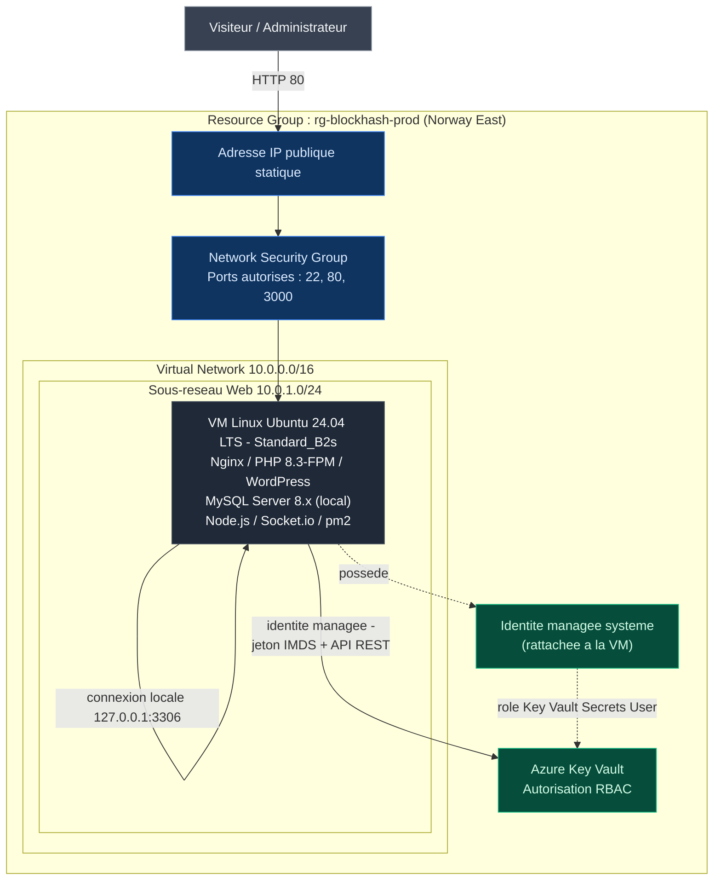
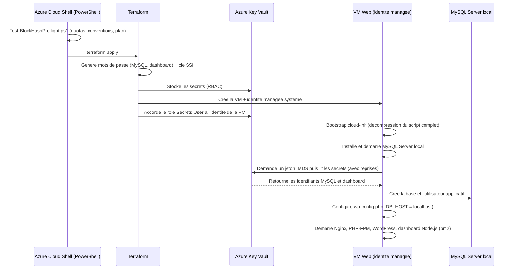
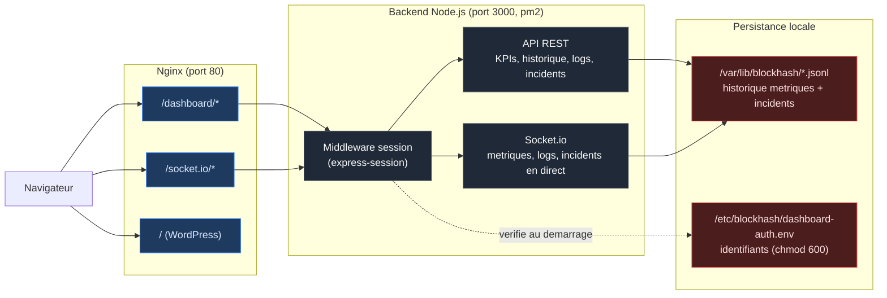
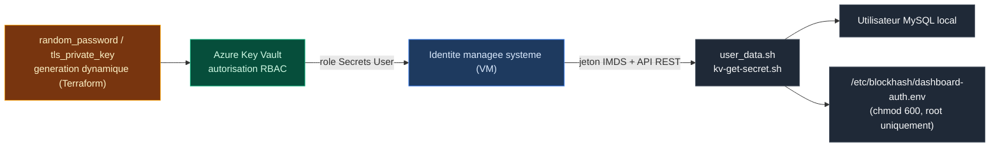

<div align="center">

# BlockHash - Azure Cloud Infrastructure

### Infrastructure-as-Code modulaire pour un socle WordPress haute-observabilite sur Microsoft Azure

[](https://developer.hashicorp.com/terraform)
[](https://azure.microsoft.com/)
[](https://registry.terraform.io/providers/hashicorp/azurerm/latest)
[]()
[]()
[]()

**[Vue d'ensemble](#vue-densemble) - [Architecture](#architecture) - [Stack technique](#stack-technique) - [Demarrage rapide](#demarrage-rapide) - [Configuration](#reference-des-variables) - [Securite](#securite-et-gestion-des-secrets) - [Observabilite](#observabilite-et-monitoring) - [Scripts de test](#scripts-de-test-disponibles-depuis-le-dashboard) - [FAQ](#questions-frequentes-et-depannage)**

</div>

---

## Sommaire

- [Vue d'ensemble](#vue-densemble)
- [Architecture](#architecture)
- [Stack technique](#stack-technique)
- [Structure du depot](#structure-du-depot)
- [Prerequis](#prerequis)
- [Demarrage rapide](#demarrage-rapide)
- [Reference des variables](#reference-des-variables)
- [Securite et gestion des secrets](#securite-et-gestion-des-secrets)
- [Observabilite et monitoring](#observabilite-et-monitoring)
- [Scripts de test disponibles depuis le dashboard](#scripts-de-test-disponibles-depuis-le-dashboard)
- [Ressources Azure provisionnees](#ressources-azure-provisionnees)
- [Sorties Terraform (outputs)](#sorties-terraform-outputs)
- [Estimation des couts](#estimation-des-couts)
- [Cycle de vie et operations](#cycle-de-vie-et-operations)
- [Questions frequentes et depannage](#questions-frequentes-et-depannage)
- [Feuille de route](#feuille-de-route)
- [Bonnes pratiques appliquees](#bonnes-pratiques-appliquees)
- [Licence et contact](#licence-et-contact)

---

## Vue d'ensemble

**BlockHash** est un projet d'infrastructure cloud 100% as-code, concu pour deployer et exploiter un socle applicatif **WordPress** sur **Microsoft Azure**, accompagne d'un **dashboard de monitoring temps reel de niveau entreprise** developpe sur-mesure.

Le projet repond a cinq exigences fondamentales :

| Exigence | Reponse apportee |
|---|---|
| Reproductibilite | Infrastructure entierement decrite en Terraform, modulaire, versionnable et re-executable a l'identique sur n'importe quel abonnement Azure. |
| Securite par conception | Aucun secret en dur dans le code : generation dynamique + Azure Key Vault + identite managee (voir [Securite](#securite-et-gestion-des-secrets)). |
| Observabilite entreprise | Dashboard authentifie, historique persistant, KPIs (uptime, latence), analytique des logs, sante des services, journal d'incidents. |
| Alerting automatique | Sondes systeme et applicatives avec notification Discord/Slack/Email et journalisation persistante des incidents. |
| Gouvernance du deploiement | Script de pre-validation PowerShell executable dans Azure Cloud Shell, controlant quotas, conventions et coherence Terraform avant tout deploiement. |

### Cas d'usage cible

Un site WordPress de production, heberge sur une VM Linux unique avec MySQL local, supervise en continu par un dashboard interne protege par authentification, exposant en direct la sante applicative (disponibilite HTTP, latence, taux d'erreurs 5xx, CPU/RAM/disque, sante des services) avec historique, KPIs et journal d'incidents.

---

## Architecture

> Choix d'architecture : Azure Database for MySQL Flexible Server a ete remplace par une installation locale de MySQL Server sur la VM Web, suite a une restriction de service constatee sur les abonnements Azure for Students (voir [FAQ](#questions-frequentes-et-depannage)).

### Vue d'infrastructure



### Flux de deploiement



### Architecture applicative du dashboard



### Pourquoi MySQL local plutot qu'un serveur managee

Sur un abonnement Azure for Students, la creation d'un serveur Azure Database for MySQL Flexible Server echoue avec l'erreur `ProvisionNotSupportedForRegion`, y compris sur des regions pourtant autorisees par la Policy de l'abonnement. Une verification via `az mysql flexible-server list-skus --location <region>` confirme un blocage au niveau du service lui-meme (erreur `InternalServerError`), independant de la region choisie.

**Compromis acceptes** en installant MySQL directement sur la VM :

| Aspect | Avec Flexible Server | Avec MySQL local |
|---|---|---|
| Disponibilite | Managee par Azure (SLA) | Dependante de la VM (pas de haute disponibilite) |
| Sauvegardes | Automatiques (7 jours) | Manuelles (voir [Feuille de route](#feuille-de-route)) |
| Isolation reseau | Sous-reseau dedie + DNS prive | Processus local, `bind-address 127.0.0.1` |
| Cout | Environ 25 a 35 euros/mois supplementaires | 0 euro supplementaire (inclus dans la VM) |
| Compatibilite Azure for Students | Non prise en charge | Fonctionne |

WordPress se connecte via `DB_HOST = 'localhost'` (valeur par defaut de `wp-config.php`) sur le port standard 3306, avec un utilisateur dedie cree automatiquement par `user_data.sh`.

---

## Stack technique

<table>
<tr><th>Couche</th><th>Technologie</th><th>Role</th></tr>

<tr><td rowspan="1"><b>Infrastructure as Code</b></td>
<td></td>
<td>Provisioning declaratif, modulaire (<code>hashicorp/azurerm</code>, <code>random</code>, <code>tls</code>, <code>time</code>)</td></tr>

<tr><td rowspan="3"><b>Cloud Provider</b></td>
<td>Azure Virtual Network</td><td>Segmentation reseau (sous-reseau Web, NSG)</td></tr>
<tr><td>Azure Linux Virtual Machine</td><td>Hote applicatif (Ubuntu 24.04 LTS)</td></tr>
<tr><td>Azure Key Vault</td><td>Coffre-fort de secrets, RBAC, identite managee</td></tr>

<tr><td rowspan="4"><b>Runtime applicatif</b></td>
<td>Nginx</td><td>Reverse proxy HTTP, terminaison WebSocket, format de log enrichi</td></tr>
<tr><td>PHP 8.3-FPM</td><td>Execution WordPress</td></tr>
<tr><td>MySQL Server 8.x (local)</td><td>Base de donnees, installee et configuree sur la VM via cloud-init</td></tr>
<tr><td>WordPress (latest)</td><td>CMS applicatif</td></tr>

<tr><td rowspan="5"><b>Dashboard entreprise</b></td>
<td>Node.js + Express</td><td>Serveur backend, API REST, reverse-proxy applicatif</td></tr>
<tr><td>express-session</td><td>Authentification par session, cookie signe, anti brute-force</td></tr>
<tr><td>Socket.io</td><td>Diffusion WebSocket authentifiee des metriques, logs et incidents</td></tr>
<tr><td>pm2</td><td>Supervision et redemarrage automatique du process Node.js</td></tr>
<tr><td>Tailwind CSS, Chart.js, Lucide Icons</td><td>Interface graphique, KPIs, graphiques, tableaux, theme clair/sombre</td></tr>

<tr><td rowspan="3"><b>Observabilite</b></td>
<td>monitor.sh (Bash + cron)</td><td>Sondes HTTP / 5xx / latence / CPU / RAM / disque / MySQL local, alerting</td></tr>
<tr><td>Discord/Slack Webhook + mailutils</td><td>Canaux de notification d'incident</td></tr>
<tr><td>stress-ng</td><td>Scripts de test de charge (voir section dediee)</td></tr>

<tr><td rowspan="1"><b>Gouvernance</b></td>
<td>PowerShell (module Az)</td><td>Pre-validation de deploiement dans Azure Cloud Shell</td></tr>
</table>

---

## Structure du depot

```text
blockhash-azure-infrastructure/
|-- main.tf                          Orchestration des modules
|-- variables.tf                     Variables d'entree du projet
|-- outputs.tf                       Sorties exposees (IP, URLs, Key Vault, dashboard...)
|-- terraform.tfvars.example         Modele de configuration a copier
|-- README.md                        Ce document
|
|-- modules/
|   |-- network/                     VNet, sous-reseau, NSG, IP publique
|   |   |-- main.tf
|   |   |-- variables.tf
|   |   `-- outputs.tf
|   |
|   |-- keyvault/                    Coffre-fort de secrets (RBAC, generation dynamique)
|   |   |-- main.tf
|   |   |-- variables.tf
|   |   `-- outputs.tf
|   |
|   `-- vm/                          VM Web, identite managee, provisioning
|       |-- main.tf
|       |-- variables.tf
|       |-- outputs.tf
|       `-- scripts/
|           `-- user_data.sh         cloud-init : Nginx, PHP, MySQL local, WordPress, dashboard
|
`-- scripts/
    `-- Test-BlockHashPreflight.ps1  Pre-validation Azure Cloud Shell (PowerShell)
```

> Le module `modules/database/` (Azure MySQL Flexible Server) a ete retire du projet - voir [Architecture](#architecture) pour le detail du changement.

---

## Prerequis

| Outil | Version minimale | Disponible par defaut dans Azure Cloud Shell |
|---|---|:---:|
| [Terraform](https://developer.hashicorp.com/terraform/downloads) | 1.6.0 ou superieure | Oui |
| [Azure CLI](https://learn.microsoft.com/cli/azure/) | 2.60 ou superieure | Oui |
| [Az PowerShell](https://learn.microsoft.com/powershell/azure/) | 11.0 ou superieure | Oui |
| Abonnement Azure actif | - | - |
| Droits IAM | `Contributor` + `User Access Administrator` (ou `Owner`) sur le Resource Group / abonnement, requis pour creer les role assignments Key Vault | - |

> Aucune cle SSH ni identifiant de base de donnees n'est requis en amont : ils sont generes automatiquement (voir [Securite](#securite-et-gestion-des-secrets)).

---

## Demarrage rapide

### 1. Cloner et configurer

```bash
git clone https://github.com/dspitech/blockhash-monitoring-wordpress.git
cd blockhash-monitoring-wordpress
cp terraform.tfvars.example terraform.tfvars
# Editez terraform.tfvars : project_name, environment, location, vm_size, etc.
```

### 2. Pre-validation (Azure Cloud Shell, PowerShell)

```powershell
./scripts/Test-BlockHashPreflight.ps1
```

Ce script verifie avant tout deploiement : session Azure, fournisseurs de ressources, quotas vCPU/IP, disponibilite regionale de la taille de VM, conventions de nommage, et execute `terraform init/validate/plan`.

### 3. Deploiement

```bash
terraform apply -auto-approve
```

### 4. Acces aux services

```bash
terraform output wordpress_url
terraform output dashboard_url
```

### 5. Connexion SSH

```bash
terraform output -raw vm_ssh_private_key > blockhash_vm_key.pem
chmod 600 blockhash_vm_key.pem
ssh -i blockhash_vm_key.pem azureadmin@$(terraform output -raw vm_public_ip_address)
```

### 6. Connexion au dashboard

```bash
terraform output -raw dashboard_admin_username
terraform output -raw dashboard_admin_password
```

Ces deux valeurs sont affichees en dernier dans la sortie de `terraform apply` (dernier bloc d'outputs), pretes a etre copiees pour la premiere connexion.

---

## Reference des variables

| Variable | Type | Defaut | Description |
|---|---|---|---|
| `project_name` | `string` | `"blockhash"` | Prefixe de nommage de toutes les ressources |
| `environment` | `string` | `"prod"` | Environnement logique (`prod`, `staging`, `dev`) |
| `location` | `string` | `"norwayeast"` | Region Azure de deploiement |
| `vnet_address_space` | `list(string)` | `["10.0.0.0/16"]` | Plage CIDR du VNet |
| `web_subnet_prefix` | `list(string)` | `["10.0.1.0/24"]` | Plage CIDR du sous-reseau Web |
| `mysql_admin_login` | `string` | `"blockhashadmin"` | Login de l'utilisateur MySQL applicatif cree localement sur la VM |
| `mysql_database_name` | `string` | `"wordpress"` | Nom de la base de donnees MySQL locale utilisee par WordPress |
| `vm_size` | `string` | `"Standard_B2s"` | Taille de la VM Web (2 vCPU / 4 Go RAM) |
| `vm_admin_username` | `string` | `"azureadmin"` | Utilisateur administrateur SSH |
| `dashboard_admin_username` | `string` | `"admin"` | Nom d'utilisateur pour la connexion au dashboard de monitoring |
| `keyvault_purge_protection_enabled` | `bool` | `false` | Protection anti-purge du Key Vault (recommande a `true` en production reelle) |
| `alert_webhook_url` | `string` (sensible) | `""` | Webhook Discord/Slack, stocke dans Key Vault |
| `alert_email` | `string` | `"ops@blockhash.io"` | Adresse email de destination des alertes |
| `tags` | `map(string)` | voir exemple | Tags Azure appliques a toutes les ressources |

> Il n'existe volontairement aucune variable `ssh_public_key`, `mysql_admin_password` ou `dashboard_admin_password` : ces valeurs sont generees automatiquement par Terraform.

---

## Securite et gestion des secrets

Le projet applique le principe "zero secret en dur" de bout en bout, y compris pour MySQL et le dashboard :



| Secret | Generation | Stockage | Consommation |
|---|---|---|---|
| Mot de passe utilisateur MySQL | `random_password` (24 caracteres, Terraform) | Key Vault (`mysql-admin-password`) | Lu au demarrage par la VM via identite managee, utilise pour creer l'utilisateur MySQL local et pour `wp-config.php` |
| Cle privee/publique SSH | `tls_private_key` (RSA 4096, Terraform) | Key Vault (`vm-ssh-private-key`) + `terraform output` sensible | Cle publique injectee dans `admin_ssh_key` de la VM |
| Webhook d'alerte | Fourni par l'utilisateur (`terraform.tfvars`) | Key Vault (`alert-webhook-url`) | Lu uniquement au moment d'envoyer une alerte reelle |
| Mot de passe admin du dashboard | `random_password` (20 caracteres, Terraform) | Key Vault (`dashboard-admin-password`) + `terraform output` sensible | Lu au demarrage, ecrit dans `/etc/blockhash/dashboard-auth.env`, lu par le process Node.js |

**Points cles d'implementation :**

- RBAC Azure (`enable_rbac_authorization = true`) plutot que les access policies historiques.
- Le compte executant Terraform recoit le role Key Vault Secrets Officer (ecriture), la VM recoit uniquement Key Vault Secrets User (lecture seule).
- `user_data.sh` ne contient aucune valeur secrete interpolee : uniquement des noms de secrets et le nom du Key Vault.
- Le mot de passe MySQL est transmis au client `mysql` via l'entree standard (heredoc), jamais en argument de ligne de commande, et injecte dans `wp-config.php` via un script Python (remplacement litteral, pas `sed`) pour eviter toute corruption liee aux caracteres speciaux generes aleatoirement.
- MySQL local ecoute uniquement sur `127.0.0.1` : aucune exposition reseau externe, aucune regle NSG dediee necessaire.
- Un durcissement minimal est applique au premier demarrage (suppression des comptes anonymes, interdiction du compte `root` hors localhost, suppression de la base `test`).
- Dashboard protege par authentification : le reverse-proxy Nginx redirige `/dashboard` et `/socket.io/` entierement vers le backend Node.js, qui applique une verification de session avant de servir la moindre page, API ou connexion WebSocket. Comparaison du mot de passe en temps constant (`crypto.timingSafeEqual`) et limitation anti brute-force (5 tentatives par 5 minutes et par IP).
- Le state Terraform contient necessairement ces valeurs (contrainte technique incontournable pour la creation des ressources Azure) : utilisez un backend distant chiffre (Azure Storage Account avec chiffrement et acces restreint) et ne versionnez jamais le state dans Git.
- Le script cloud-init complet est transmis a la VM sous forme compressee (gzip + base64 via la fonction Terraform `base64gzip()`), encapsule dans un court bootstrap qui le decompresse au demarrage. Ce mecanisme contourne la limite Azure de 87380 caracteres sur `custom_data`, atteinte par la richesse du dashboard entreprise.

---

## Observabilite et monitoring

Le dashboard (`/dashboard`) est une application interne protegee par authentification, accessible uniquement via `/dashboard/login`.

### KPIs (bandeau d'en-tete)

| KPI | Calcul |
|---|---|
| Disponibilite 24h / 7j | Pourcentage d'echantillons systeme avec statut HTTP different de `000`, sur l'historique persistant |
| Latence moyenne / p95 | Calculee en direct depuis `$request_time` (Nginx), fenetre glissante de 1000 requetes |
| Requetes aujourd'hui | Compteur en direct depuis le flux de logs Nginx (reinitialise chaque jour) |
| Incidents (24h) | Nombre d'alertes journalisees dans les dernieres 24 heures |

### Historique et tendances

- Graphique multi-plage (1h / 6h / 24h / 7j) CPU/RAM/Disque, alimente par un historique persistant sur disque (1 point par minute, retention d'environ 7 jours, `/var/lib/blockhash/metrics-history.jsonl`).
- Repartition des codes HTTP (2xx/3xx/4xx/5xx) en diagramme circulaire, calculee en direct depuis le flux de logs.
- Top endpoints et top adresses IP (tableaux, comptage en direct, reinitialise chaque jour).

### Sante et incidents

- Panneau de sante des services : Nginx, PHP-FPM, MySQL local, dashboard Node.js lui-meme (statut actif/inactif via `systemctl is-active`).
- Journal d'incidents persistant : chaque alerte de `monitor.sh` est journalisee et declenche une notification instantanee dans l'interface, en plus des canaux externes (webhook, email).
- Terminal de logs Nginx en direct (WebSocket, code couleur par statut HTTP).
- Theme clair/sombre, preference memorisee localement.

### Sondes automatiques (monitor.sh, cron toutes les 5 minutes)

| Sonde | Seuil d'alerte |
|---|---|
| Disponibilite HTTP | Code `000` (site injoignable) |
| Taux d'erreurs 5xx (1000 dernieres requetes) | Superieur a 5% |
| Charge CPU | Superieure a 85% |
| Utilisation RAM | Superieure a 90% |
| Espace disque | Superieur a 85% |
| Disponibilite MySQL local | Echec de `mysqladmin ping` |

Les alertes sont envoyees simultanement par webhook (Discord/Slack), par email (`mailutils`), et journalisees de facon persistante pour alimenter le dashboard.

> Limites connues (compromis assumes pour un outil interne a faible echelle) : les compteurs de codes HTTP, top endpoints et top IPs vivent en memoire et sont reinitialises a chaque redemarrage du process Node.js (rare, gere par pm2). Les sessions de connexion ne survivent pas non plus a un redemarrage. L'historique des metriques et des incidents, lui, est bien persistant sur disque.

---

## Scripts de test disponibles depuis le dashboard

La section "Scripts de test" du dashboard permet de declencher des situations degradees controlees et auto-reversibles, afin de valider l'ensemble de la chaine de supervision (sonde, alerte, journal d'incidents, KPIs) sans attendre un incident reel.

| Test | Script sur la VM | Effet | Sonde/KPI valide |
|---|---|---|---|
| Erreurs HTTP 500 | `/usr/local/bin/test_5xx.sh` | Envoie 30 requetes vers une page PHP renvoyant systematiquement un code 500 | Taux d'erreurs 5xx (monitor.sh), diagramme de repartition des codes HTTP |
| Charge CPU | `/usr/local/bin/test_cpu_stress.sh [duree]` | Sature tous les coeurs via `stress-ng` pendant 60 secondes par defaut | Sonde de charge CPU (monitor.sh), graphique CPU temps reel |
| Latence elevee | `/usr/local/bin/test_high_latency.sh [nb_requetes] [duree_sleep]` | Envoie 15 requetes vers une page PHP marquant une pause artificielle de 3 secondes | KPI de latence moyenne et p95 |
| Coupure MySQL | `/usr/local/bin/test_mysql_down.sh [duree]` | Arrete le service MySQL local 20 secondes puis le redemarre automatiquement | Sonde de disponibilite MySQL (monitor.sh) |

Chaque script peut aussi etre execute manuellement en SSH, avec une duree personnalisee :

```bash
# Charge CPU pendant 2 minutes
sudo /usr/local/bin/test_cpu_stress.sh 120

# 30 requetes lentes avec une pause de 5 secondes chacune
sudo /usr/local/bin/test_high_latency.sh 30 5

# Coupure MySQL de 45 secondes
sudo /usr/local/bin/test_mysql_down.sh 45
```

> Le test de coupure MySQL rend WordPress indisponible pendant sa duree d'execution : a reserver a un environnement de demonstration ou hors heures de forte frequentation.

---

## Ressources Azure provisionnees

| Ressource | Nom (convention) | Module |
|---|---|---|
| Resource Group | `rg-<project>-<env>` | `network` |
| Virtual Network | `vnet-<project>-<env>` (10.0.0.0/16) | `network` |
| Sous-reseau Web | `snet-web` (10.0.1.0/24) | `network` |
| Network Security Group | `nsg-web` (ports 22, 80, 3000) | `network` |
| Adresse IP publique statique | `pip-web-<env>` | `network` |
| Key Vault (RBAC) | `kv-<project>-<env>-<suffixe>` | `keyvault` |
| Interface reseau | `nic-web-<env>` | `vm` |
| Machine virtuelle | `vm-web-<env>` (Ubuntu 24.04 LTS) | `vm` |
| Identite managee systeme | rattachee a la VM | `vm` |
| MySQL Server 8.x | local, sur la VM (pas de ressource Azure dediee) | `vm` (provisionne par `user_data.sh`) |

> Il n'y a ni sous-reseau delegue MySQL, ni zone DNS privee, ni serveur MySQL Flexible Server : MySQL est un simple service Linux tournant sur la VM Web (voir [Architecture](#architecture)).

---

## Sorties Terraform (outputs)

| Output | Sensible | Description |
|---|:---:|---|
| `vm_public_ip_address` | Non | Adresse IP publique de la VM |
| `wordpress_url` | Non | URL du site WordPress |
| `dashboard_url` | Non | URL de connexion au dashboard de monitoring |
| `ssh_connection_command` | Non | Commande SSH prete a l'emploi |
| `resource_group_name` | Non | Nom du Resource Group |
| `key_vault_name` | Non | Nom du Key Vault |
| `key_vault_uri` | Non | URI du Key Vault |
| `vm_ssh_private_key` | Oui | Cle privee SSH generee par Terraform |
| `dashboard_admin_username` | Non | Nom d'utilisateur du dashboard (avant-dernier output) |
| `dashboard_admin_password` | Oui | Mot de passe du dashboard, genere par Terraform (tout dernier output) |

Les deux derniers outputs (`dashboard_admin_username` et `dashboard_admin_password`) sont volontairement places en fin de fichier `outputs.tf` : ce sont les toutes dernieres informations affichees a l'ecran apres `terraform apply`, pretes a etre recuperees pour la premiere connexion au dashboard.

---

## Estimation des couts

> Estimation indicative pour la region Norway East, hors taxes, susceptible d'evoluer selon la tarification Azure en vigueur.

| Ressource | SKU | Estimation mensuelle |
|---|---|---|
| VM Linux | Standard_B2s (2 vCPU, 4 Go) | 30 a 40 euros |
| Disque OS VM | 30 Go StandardSSD_LRS | 3 a 4 euros |
| IP publique statique | Standard SKU | 3 a 4 euros |
| Key Vault | Standard, usage faible | Moins de 1 euro |
| MySQL Server (local) | Inclus dans la VM | 0 euro supplementaire |
| **Total estime** | | **35 a 45 euros par mois** |

> Utilisez la [calculatrice de prix Azure](https://azure.microsoft.com/pricing/calculator/) pour un chiffrage precis selon votre region et vos volumes reels.

---

## Cycle de vie et operations

```bash
# Mise a jour de l'infrastructure apres modification du code
terraform plan
terraform apply

# Destruction complete de l'environnement
terraform destroy
```

> Si `keyvault_purge_protection_enabled = true`, le Key Vault reste en "soft delete" 7 jours apres `destroy`, bloquant la reutilisation immediate du meme nom de projet/environnement.

---

## Questions frequentes et depannage

<details>
<summary>Erreur "Custom data ... maximum length of 87380 characters" au deploiement</summary>

Azure limite le champ `custom_data` (cloud-init) a 87380 caracteres une fois encode en base64. Le script complet `user_data.sh` (dashboard entreprise inclus) depasse cette limite en clair. La solution est deja en place dans `modules/vm/main.tf` : le script complet est compresse en gzip (`base64gzip()`), embarque dans un petit script bootstrap qui le decompresse et l'execute au demarrage. Consultez `/var/log/user-data-bootstrap.log` puis `/var/log/user-data.log` sur la VM pour diagnostiquer un eventuel probleme a ce niveau.
</details>

<details>
<summary>Comment se connecter au dashboard pour la premiere fois</summary>

Apres `terraform apply`, recuperez les deux derniers outputs affiches :

```bash
terraform output -raw dashboard_admin_username
terraform output -raw dashboard_admin_password
```

Ouvrez ensuite `terraform output dashboard_url` et connectez-vous avec ces identifiants.
</details>

<details>
<summary>J'ai perdu le mot de passe du dashboard, comment le changer</summary>

Modifiez le secret `dashboard-admin-password` dans Key Vault (`az keyvault secret set ...`), puis mettez a jour `/etc/blockhash/dashboard-auth.env` sur la VM (via SSH) avec la nouvelle valeur, et relancez le process : `pm2 restart blockhash-dashboard`. Terraform ne reagit pas automatiquement a un changement de secret fait hors de son controle.
</details>

<details>
<summary>Ou sont stockees les donnees historiques du dashboard (metriques, incidents)</summary>

Dans `/var/lib/blockhash/` sur la VM (fichiers JSON Lines : `metrics-history.jsonl`, `incidents.jsonl`). Ce n'est pas une base de donnees externe : en cas de suppression de la VM (`terraform destroy`), cet historique est perdu. Pour une retention plus longue, voir la [Feuille de route](#feuille-de-route) (sauvegardes vers Azure Blob Storage).
</details>

<details>
<summary>Pourquoi ne pas utiliser Azure Database for MySQL Flexible Server</summary>

Sur les abonnements Azure for Students, la creation d'un serveur MySQL Flexible Server echoue avec `ProvisionNotSupportedForRegion`, meme sur des regions autorisees par la Policy de l'abonnement. La commande `az mysql flexible-server list-skus --location <region>` renvoie une `InternalServerError`, confirmant un blocage au niveau du service plutot que de la region. MySQL est donc installe localement sur la VM (voir [Architecture](#architecture)). Sur un abonnement standard, un module `database` base sur Flexible Server reste tout a fait viable.
</details>

<details>
<summary>Le premier demarrage echoue a recuperer les secrets Key Vault</summary>

La propagation des roles RBAC Azure peut prendre jusqu'a quelques dizaines de secondes. Le script `kv-get-secret.sh` retente automatiquement (jusqu'a 20 tentatives, 15 secondes d'intervalle, pour les identifiants MySQL au demarrage). Consultez `/var/log/user-data.log` sur la VM pour diagnostiquer.
</details>

<details>
<summary>Le script PowerShell signale un quota vCPU insuffisant</summary>

Demandez une augmentation de quota via le portail Azure (Support et aide de depannage, puis Augmentation de quota) pour la famille "Basic A / B Series" dans la region ciblee.
</details>

<details>
<summary>Puis-je utiliser une autre region que Norway East</summary>

Oui : modifiez `location` dans `terraform.tfvars`, puis relancez `Test-BlockHashPreflight.ps1` pour verifier la disponibilite de `vm_size` et des quotas dans la nouvelle region.
</details>

---

## Feuille de route

Les evolutions suivantes sont documentees separement dans la roadmap operationnelle BlockHash (securite applicative, haute disponibilite, sauvegardes, APM, CI/CD) :

- HTTPS/SSL automatise (Certbot) et protection Fail2ban/GeoIP
- Haute disponibilite (VM Scale Sets, Load Balancer)
- Sauvegardes automatisees vers Azure Blob Storage
- APM avance (latence p95/p99 historisee, calculateur de SLA sur 30 jours)
- Pipeline CI/CD (GitHub Actions ou Azure DevOps, tflint, Checkov)

---

## Bonnes pratiques appliquees

- Infrastructure entierement modulaire et reutilisable (3 modules independants)
- Zero secret en dur : generation dynamique, Key Vault et identite managee
- Nommage coherent et previsible de toutes les ressources
- Reseau segmente, regles NSG a moindre privilege
- Dashboard protege par authentification, jamais expose en acces libre
- Observabilite integree des le provisioning, sans outil tiers requis
- Validation pre-deploiement automatisee (quotas, conventions, `terraform plan`)
- Documentation exhaustive et code abondamment commente

---

## Licence et contact

Projet interne BlockHash, usage proprietaire.

Pour toute question technique, ouvrez une issue sur le depot ou contactez l'equipe Infrastructure/DevOps de BlockHash.
