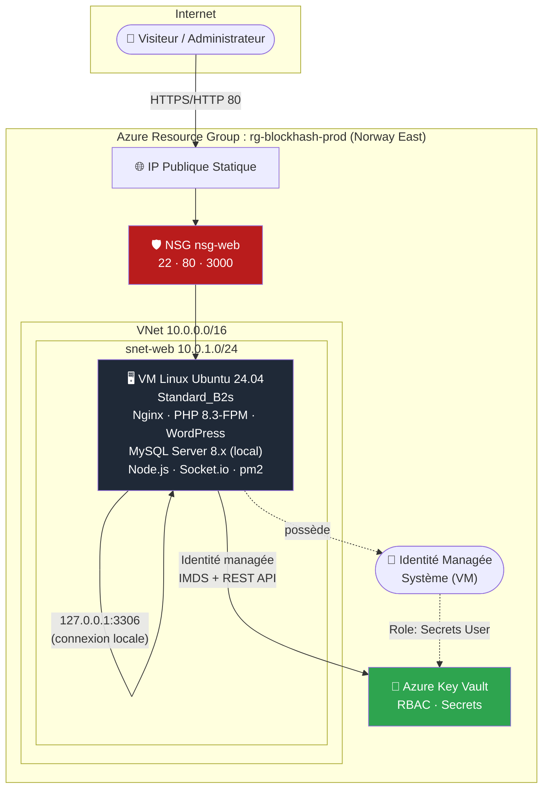
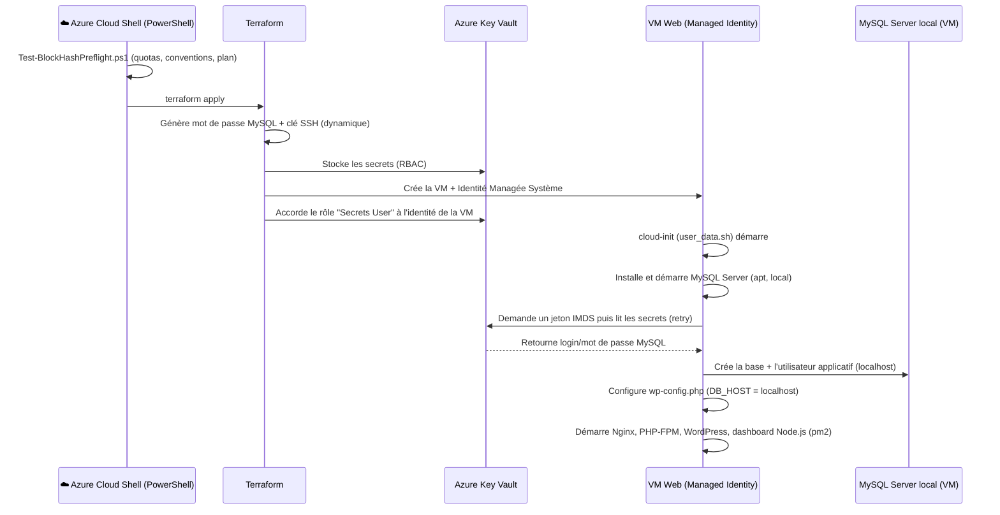

<div align="center">

# ⚡ BlockHash — Azure Cloud Infrastructure

### Infrastructure-as-Code modulaire pour un socle WordPress haute-observabilité sur Microsoft Azure

[](https://developer.hashicorp.com/terraform)
[](https://azure.microsoft.com/)
[](https://registry.terraform.io/providers/hashicorp/azurerm/latest)
[]()
[]()
[]()

**[Vue d'ensemble](#-vue-densemble) • [Architecture](#-architecture) • [Stack technique](#-stack-technique) • [Démarrage rapide](#-démarrage-rapide) • [Configuration](#-référence-des-variables) • [Sécurité](#-sécurité--gestion-des-secrets) • [Observabilité](#-observabilité--monitoring) • [FAQ](#-questions-fréquentes--dépannage)**

</div>

---

## 📋 Sommaire

- [Vue d'ensemble](#-vue-densemble)
- [Architecture](#-architecture)
- [Stack technique](#-stack-technique)
- [Structure du dépôt](#-structure-du-dépôt)
- [Prérequis](#-prérequis)
- [Démarrage rapide](#-démarrage-rapide)
- [Référence des variables](#-référence-des-variables)
- [Sécurité & gestion des secrets](#-sécurité--gestion-des-secrets)
- [Observabilité & Monitoring](#-observabilité--monitoring)
- [Ressources Azure provisionnées](#-ressources-azure-provisionnées)
- [Sorties Terraform (outputs)](#-sorties-terraform-outputs)
- [Estimation des coûts](#-estimation-des-coûts)
- [Cycle de vie & opérations](#-cycle-de-vie--opérations)
- [Questions fréquentes / Dépannage](#-questions-fréquentes--dépannage)
- [Feuille de route](#-feuille-de-route)
- [Bonnes pratiques appliquées](#-bonnes-pratiques-appliquées)
- [Licence & contact](#-licence--contact)

---

## 🎯 Vue d'ensemble

**BlockHash** est un projet d'infrastructure cloud **100 % as-code**, conçu pour déployer et exploiter un socle applicatif **WordPress** sur **Microsoft Azure**, accompagné d'un **dashboard de monitoring temps réel de niveau entreprise** développé sur-mesure.

Le projet répond à cinq exigences fondamentales :

| Exigence | Réponse apportée |
|---|---|
| **Reproductibilité** | Infrastructure entièrement décrite en Terraform, modulaire, versionnable et ré-exécutable à l'identique sur n'importe quel abonnement Azure. |
| **Sécurité par conception** | Aucun secret en dur dans le code : génération dynamique + Azure Key Vault + identité managée (voir [Sécurité](#-sécurité--gestion-des-secrets)). |
| **Observabilité entreprise** | Dashboard authentifié, historique persistant, KPIs (uptime/latence), analytics de logs, santé des services, journal d'incidents (voir [Observabilité](#-observabilité--monitoring)). |
| **Alerting automatique** | Sondes système/applicatives avec notification Discord/Slack/Email et journalisation persistante des incidents. |
| **Gouvernance du déploiement** | Script de pré-validation PowerShell exécutable dans Azure Cloud Shell, contrôlant quotas, conventions et cohérence Terraform **avant** tout déploiement. |

### Cas d'usage cible

Un site WordPress de production, hébergé sur une VM Linux unique avec MySQL local, supervisé en continu par un dashboard interne **protégé par authentification**, exposant en direct la santé applicative (disponibilité HTTP, latence, taux d'erreurs 5xx, CPU/RAM/disque, santé des services) avec historique, KPIs et journal d'incidents.

---

## 🏗️ Architecture

> ℹ️ **Choix d'architecture (v2)** : Azure Database for MySQL Flexible Server a été remplacé par une **installation locale de MySQL Server sur la VM Web**, suite à une restriction de service constatée sur les abonnements **Azure for Students** (voir [FAQ](#-questions-fréquentes--dépannage)). Le détail du compromis est expliqué en fin de section.



### Flux applicatif



### Pourquoi MySQL local plutôt qu'un serveur managé ?

Sur un abonnement **Azure for Students**, la création d'un serveur **Azure Database for MySQL Flexible Server** échoue avec l'erreur `ProvisionNotSupportedForRegion`, y compris sur des régions pourtant autorisées par la Policy de l'abonnement. Une vérification via `az mysql flexible-server list-skus --location <region>` confirme un blocage au niveau du **service lui-même** (erreur `InternalServerError`), indépendant de la région choisie : ce type d'abonnement n'a tout simplement pas accès à ce service managé.

**Compromis acceptés** en installant MySQL directement sur la VM :

| Aspect | Avec Flexible Server (v1) | Avec MySQL local (v2) |
|---|---|---|
| Disponibilité | Managée par Azure (SLA) | Dépend uniquement de la VM (pas de HA) |
| Sauvegardes | Automatiques (7 jours) | **Manuelles** (à planifier soi-même, voir [Feuille de route](#-feuille-de-route)) |
| Montée en charge | Scaling indépendant de la VM | Couplée aux ressources de la VM (CPU/RAM partagés) |
| Isolation réseau | Sous-réseau dédié + DNS privé | Processus local, aucune exposition réseau externe (`bind-address 127.0.0.1`) |
| Coût | ~25-35 €/mois supplémentaires | **0 € supplémentaire** (inclus dans la VM) |
| Compatibilité Azure for Students | ❌ Bloqué | ✅ Fonctionne |

WordPress se connecte à MySQL via `DB_HOST = 'localhost'` (valeur par défaut de `wp-config.php`, aucune modification nécessaire) sur le port standard **3306**, avec un utilisateur dédié (non `root`) créé automatiquement par `user_data.sh`. Cette configuration reste tout à fait adaptée à un **projet pédagogique / démonstration** : elle n'est pas recommandée telle quelle pour une charge de production critique sans ajouter au minimum des sauvegardes automatisées (voir roadmap).

---

## 🧰 Stack technique

<table>
<tr><th>Couche</th><th>Technologie</th><th>Rôle</th></tr>

<tr><td rowspan="1"><b>Infrastructure as Code</b></td>
<td></td>
<td>Provisioning déclaratif, modulaire (<code>hashicorp/azurerm</code>, <code>random</code>, <code>tls</code>, <code>time</code>)</td></tr>

<tr><td rowspan="3"><b>Cloud Provider</b></td>
<td>Azure Virtual Network</td><td>Segmentation réseau (sous-réseau Web, NSG)</td></tr>
<tr><td>Azure Linux Virtual Machine</td><td>Hôte applicatif (Ubuntu 24.04 LTS)</td></tr>
<tr><td>Azure Key Vault</td><td>Coffre-fort de secrets, RBAC, identité managée</td></tr>

<tr><td rowspan="4"><b>Runtime applicatif</b></td>
<td>Nginx</td><td>Reverse proxy HTTP + terminaison WebSocket</td></tr>
<tr><td>PHP 8.3-FPM</td><td>Exécution WordPress</td></tr>
<tr><td>MySQL Server 8.x (local)</td><td>Base de données, installée et configurée sur la VM via cloud-init</td></tr>
<tr><td>WordPress (latest)</td><td>CMS applicatif</td></tr>

<tr><td rowspan="5"><b>Dashboard entreprise</b></td>
<td>Node.js + Express</td><td>Serveur backend, API REST, reverse-proxy applicatif</td></tr>
<tr><td>express-session</td><td>Authentification par session, cookie signé, anti brute-force</td></tr>
<tr><td>Socket.io</td><td>Diffusion WebSocket authentifiée des métriques, logs et incidents</td></tr>
<tr><td>pm2</td><td>Supervision et redémarrage automatique du process Node.js</td></tr>
<tr><td>Tailwind CSS · Chart.js · Lucide Icons</td><td>Interface "Dark/Light Glassmorphism", KPIs, graphiques, tableaux</td></tr>

<tr><td rowspan="2"><b>Observabilité</b></td>
<td>monitor.sh (Bash + cron)</td><td>Sondes HTTP / 5xx / latence / CPU / RAM / disque / MySQL local, alerting + journal d'incidents persistant</td></tr>
<tr><td>Discord/Slack Webhook + mailutils</td><td>Canaux de notification d'incident</td></tr>

<tr><td rowspan="1"><b>Gouvernance</b></td>
<td>PowerShell (Az module)</td><td>Pré-validation de déploiement dans Azure Cloud Shell</td></tr>
</table>

---

## 📁 Structure du dépôt

```text
blockhash-azure-infrastructure/
├── main.tf                          # Orchestration des modules
├── variables.tf                     # Variables d'entrée du projet
├── outputs.tf                       # Sorties exposées (IP, URLs, Key Vault...)
├── terraform.tfvars.example         # Modèle de configuration à copier
├── README.md                        # Ce document
│
├── modules/
│   ├── network/                     # VNet, sous-réseaux, NSG, IP publique
│   │   ├── main.tf
│   │   ├── variables.tf
│   │   └── outputs.tf
│   │
│   ├── keyvault/                    # Coffre-fort de secrets (RBAC + génération dynamique)
│   │   ├── main.tf
│   │   ├── variables.tf
│   │   └── outputs.tf
│   │
│   └── vm/                          # VM Web + identité managée + provisioning
│       ├── main.tf
│       ├── variables.tf
│       ├── outputs.tf
│       └── scripts/
│           └── user_data.sh         # cloud-init : Nginx/PHP/MySQL local/WordPress/Dashboard/Monitoring
│
└── scripts/
    └── Test-BlockHashPreflight.ps1  # Pré-validation Azure Cloud Shell (PowerShell)
```

> ℹ️ Le module `modules/database/` (Azure MySQL Flexible Server) a été retiré du projet — voir [Architecture](#-architecture) pour le détail du changement.

---

## ✅ Prérequis

| Outil | Version minimale | Disponible par défaut dans Azure Cloud Shell |
|---|---|:---:|
| [Terraform](https://developer.hashicorp.com/terraform/downloads) | ≥ 1.6.0 | ✅ |
| [Azure CLI](https://learn.microsoft.com/cli/azure/) | ≥ 2.60 | ✅ |
| [Az PowerShell](https://learn.microsoft.com/powershell/azure/) | ≥ 11.0 | ✅ |
| Abonnement Azure actif | — | — |
| Droits IAM | `Contributor` + `User Access Administrator` (ou `Owner`) sur le Resource Group / abonnement, requis pour créer les role assignments Key Vault | — |

> 💡 Aucune clé SSH ni identifiant de base de données n'est requis en amont : ils sont générés automatiquement (voir [Sécurité](#-sécurité--gestion-des-secrets)).

---

## 🚀 Démarrage rapide

### 1. Cloner et configurer

```bash
git clone <url-du-depot> blockhash-azure-infrastructure
cd blockhash-azure-infrastructure
cp terraform.tfvars.example terraform.tfvars
# Éditez terraform.tfvars : project_name, environment, location, vm_size, etc.
```

### 2. Pré-validation (Azure Cloud Shell — PowerShell)

```powershell
./scripts/Test-BlockHashPreflight.ps1
```

Ce script vérifie **avant tout déploiement** : session Azure, fournisseurs de ressources, quotas vCPU/IP, disponibilité régionale de la taille de VM, conventions de nommage, et exécute `terraform init/validate/plan`.

### 3. Déploiement

```bash
terraform init
terraform apply
```

### 4. Accès aux services

```bash
terraform output wordpress_url
terraform output dashboard_url

# Identifiants du dashboard
terraform output -raw dashboard_admin_username
az keyvault secret show \
  --vault-name $(terraform output -raw key_vault_name) \
  --name dashboard-admin-password \
  --query value -o tsv
```

### 5. Connexion SSH

```bash
terraform output -raw vm_ssh_private_key > blockhash_vm_key.pem
chmod 600 blockhash_vm_key.pem
ssh -i blockhash_vm_key.pem azureadmin@$(terraform output -raw vm_public_ip_address)
```

---

## ⚙️ Référence des variables

| Variable | Type | Défaut | Description |
|---|---|---|---|
| `project_name` | `string` | `"blockhash"` | Préfixe de nommage de toutes les ressources |
| `environment` | `string` | `"prod"` | Environnement logique (`prod`, `staging`, `dev`) |
| `location` | `string` | `"norwayeast"` | Région Azure de déploiement |
| `vnet_address_space` | `list(string)` | `["10.0.0.0/16"]` | Plage CIDR du VNet |
| `web_subnet_prefix` | `list(string)` | `["10.0.1.0/24"]` | Plage CIDR du sous-réseau Web |
| `mysql_admin_login` | `string` | `"blockhashadmin"` | Login de l'utilisateur MySQL applicatif créé **localement** sur la VM (stocké dans Key Vault) |
| `mysql_database_name` | `string` | `"wordpress"` | Nom de la base de données MySQL locale utilisée par WordPress |
| `vm_size` | `string` | `"Standard_B2s"` | Taille de la VM Web (2 vCPU / 4 Go RAM) |
| `vm_admin_username` | `string` | `"azureadmin"` | Utilisateur administrateur SSH |
| `dashboard_admin_username` | `string` | `"admin"` | Nom d'utilisateur pour la connexion au dashboard de monitoring |
| `keyvault_purge_protection_enabled` | `bool` | `false` | Protection anti-purge du Key Vault (`true` recommandé en production réelle) |
| `alert_webhook_url` | `string` (sensible) | `""` | Webhook Discord/Slack, stocké dans Key Vault |
| `alert_email` | `string` | `"ops@blockhash.io"` | Adresse email de destination des alertes |
| `tags` | `map(string)` | `{project, environment, managed_by}` | Tags Azure appliqués à toutes les ressources |

> ⚠️ Il n'existe **volontairement aucune variable** `ssh_public_key` ou `mysql_admin_password` : ces valeurs sont générées automatiquement par Terraform.
>
> ℹ️ **v2** : les variables `db_subnet_prefix`, `mysql_sku_name`, `mysql_storage_size_gb` et `mysql_version` ont été retirées — elles n'ont plus d'utilité depuis le passage à une installation MySQL locale sur la VM (voir [Architecture](#-architecture)).

---

## 🔐 Sécurité & gestion des secrets

Le projet applique le principe **« zéro secret en dur »** de bout en bout — y compris avec MySQL installé localement :

```mermaid
flowchart LR
    A["🎲 random_password<br/>tls_private_key"] -->|génération dynamique| B["🔑 Azure Key Vault<br/>(RBAC)"]
    B -->|"Secrets User"<br/>role assignment| C["🪪 Identité Managée<br/>Système (VM)"]
    C -->|jeton IMDS + REST API| D["📜 user_data.sh<br/>kv-get-secret.sh"]
    D -->|"CREATE USER ... IDENTIFIED BY"<br/>(stdin, jamais en argument CLI)| E["🗄️ MySQL local<br/>(127.0.0.1:3306)"]
    D -->|injection en mémoire| F["📄 wp-config.php"]

    style B fill:#2ea44f,color:#fff
    style A fill:#f59e0b,color:#000
```

| Secret | Génération | Stockage | Consommation |
|---|---|---|---|
| Mot de passe utilisateur MySQL | `random_password` (24 car., Terraform) | Key Vault (`mysql-admin-password`) | Lu au boot par la VM via Managed Identity, utilisé pour créer l'utilisateur MySQL **local** et pour `wp-config.php` |
| Clé privée/publique SSH | `tls_private_key` (RSA 4096, Terraform) | Key Vault (`vm-ssh-private-key`) + `terraform output` sensible | Clé publique injectée dans `admin_ssh_key` de la VM |
| Webhook d'alerte | Fourni par l'utilisateur (`terraform.tfvars`) | Key Vault (`alert-webhook-url`) | Lu uniquement au moment d'envoyer une alerte réelle |
| Mot de passe admin du dashboard | `random_password` (20 car., Terraform) | Key Vault (`dashboard-admin-password`) | Lu au boot, écrit dans `/etc/blockhash/dashboard-auth.env` (chmod 600, root uniquement), lu par le process Node.js au démarrage |

**Points clés d'implémentation :**

- **RBAC Azure** (`enable_rbac_authorization = true`) plutôt que les "access policies" historiques.
- Le compte exécutant Terraform reçoit le rôle **Key Vault Secrets Officer** (écriture), la VM reçoit uniquement **Key Vault Secrets User** (lecture seule).
- `user_data.sh` ne contient **aucune valeur secrète interpolée** — uniquement des noms de secrets et le nom du Key Vault.
- Le mot de passe MySQL est transmis au client `mysql` via **l'entrée standard** (heredoc), jamais en argument de ligne de commande (qui serait visible via `ps aux`), et injecté dans `wp-config.php` via un script **Python** (remplacement littéral, pas `sed`) pour éviter toute corruption liée aux caractères spéciaux générés aléatoirement.
- MySQL local écoute uniquement sur `127.0.0.1` (`bind-address` par défaut d'Ubuntu) : aucune exposition réseau externe, aucune règle NSG dédiée nécessaire.
- Un durcissement minimal est appliqué au premier démarrage (suppression des comptes anonymes, interdiction du compte `root` hors localhost, suppression de la base `test`).
- Les variables d'environnement contenant des identifiants sont explicitement `unset` après usage sur la VM.
- **Dashboard protégé par authentification** : le reverse-proxy Nginx redirige `/dashboard` et `/socket.io/` entièrement vers le backend Node.js (plus de fichiers statiques exposés directement), qui applique une vérification de session **avant** de servir la moindre page ou le moindre appel API — y compris les connexions WebSocket (middleware `express-session` partagé avec Socket.io). Comparaison du mot de passe en temps constant (`crypto.timingSafeEqual`) et limitation anti brute-force (5 tentatives / 5 min par IP).
- Le **state Terraform** contient nécessairement ces valeurs (contrainte technique incontournable pour la création des ressources Azure) : utilisez un **backend distant chiffré** (Azure Storage Account avec chiffrement et accès restreint) et ne versionnez jamais le state dans Git.

---

## 📊 Observabilité & Monitoring

Le dashboard (`/dashboard`) est une **application interne protégée par authentification**, accessible uniquement via `/dashboard/login` (identifiants générés par Terraform, stockés dans Key Vault — voir [Sécurité](#-sécurité--gestion-des-secrets)).

### KPIs (bandeau d'en-tête)

| KPI | Calcul |
|---|---|
| Disponibilité 24h / 7j | % d'échantillons système avec statut HTTP ≠ `000`, sur l'historique persistant |
| Latence moyenne / p95 | Calculée en direct depuis `$request_time` (Nginx), fenêtre glissante de 1000 requêtes |
| Requêtes aujourd'hui | Compteur en direct depuis le flux de logs Nginx (réinitialisé chaque jour) |
| Incidents (24h) | Nombre d'alertes journalisées dans les dernières 24h |

### Historique & tendances

- **Graphique multi-plage** (1h / 6h / 24h / 7j) CPU/RAM/Disque, alimenté par un historique persistant sur disque (1 point/minute, rétention ~7 jours, `/var/lib/blockhash/metrics-history.jsonl`).
- **Répartition des codes HTTP** (2xx/3xx/4xx/5xx) en donut chart, calculée en direct depuis le flux de logs.
- **Top endpoints** et **Top adresses IP** (tableaux, comptage en direct, réinitialisé chaque jour).

### Santé & incidents

- **Panneau de santé des services** : Nginx, PHP-FPM, MySQL local, dashboard Node.js lui-même (statut actif/inactif via `systemctl is-active`).
- **Journal d'incidents persistant** : chaque alerte de `monitor.sh` est journalisée (`/var/log/blockhash-incidents.log` → `/var/lib/blockhash/incidents.jsonl`) et déclenche une **notification "toast" en direct** dans l'interface, en plus des canaux externes (webhook/email).
- **Terminal de logs Nginx en direct** (WebSocket, code couleur par statut HTTP).
- **Déclenchement manuel** d'un test d'erreur 5xx depuis l'interface.
- **Thème clair/sombre**, préférence mémorisée localement.

### Sondes automatiques (`monitor.sh`, cron toutes les 5 min)

| Sonde | Seuil d'alerte |
|---|---|
| Disponibilité HTTP | Code `000` (site injoignable) |
| Taux d'erreurs 5xx (1000 dernières requêtes) | > 5 % |
| Charge CPU | > 85 % |
| Utilisation RAM | > 90 % |
| Espace disque | > 85 % |
| Disponibilité MySQL local | Échec de `mysqladmin ping` |

Les alertes sont envoyées simultanément par **webhook** (Discord/Slack), par **email** (`mailutils`), et **journalisées de façon persistante** pour alimenter le dashboard.

> ℹ️ **Limites connues** (compromis assumés pour un outil interne à faible échelle) : les compteurs de codes HTTP / top endpoints / top IPs vivent en mémoire et sont réinitialisés à chaque redémarrage du process Node.js (rare, géré par pm2) ; les sessions de connexion ne survivent pas non plus à un redémarrage. L'historique des métriques et des incidents, lui, est bien persistant sur disque.

---

## 🧱 Ressources Azure provisionnées

| Ressource | Nom (convention) | Module |
|---|---|---|
| Resource Group | `rg-<project>-<env>` | `network` |
| Virtual Network | `vnet-<project>-<env>` (10.0.0.0/16) | `network` |
| Sous-réseau Web | `snet-web` (10.0.1.0/24) | `network` |
| Network Security Group | `nsg-web` (22, 80, 3000) | `network` |
| IP Publique statique | `pip-web-<env>` | `network` |
| Key Vault (RBAC) | `kv-<project>-<env>-<suffixe>` | `keyvault` |
| Interface réseau | `nic-web-<env>` | `vm` |
| Machine Virtuelle | `vm-web-<env>` (Ubuntu 24.04 LTS) | `vm` |
| Identité managée système | (rattachée à la VM) | `vm` |
| MySQL Server 8.x | *(local, sur la VM — pas de ressource Azure dédiée)* | `vm` (provisionné par `user_data.sh`) |

> ℹ️ **v2** : plus de sous-réseau délégué MySQL, plus de zone DNS privée, plus de serveur MySQL Flexible Server — MySQL est un simple service Linux tournant sur la VM Web (voir [Architecture](#-architecture)).

---

## 📤 Sorties Terraform (outputs)

| Output | Sensible | Description |
|---|:---:|---|
| `vm_public_ip_address` | non | Adresse IP publique de la VM |
| `wordpress_url` | non | URL du site WordPress |
| `dashboard_url` | non | URL de connexion au dashboard de monitoring |
| `dashboard_admin_username` | non | Nom d'utilisateur du dashboard (mot de passe : Key Vault) |
| `ssh_connection_command` | non | Commande SSH prête à l'emploi |
| `resource_group_name` | non | Nom du Resource Group |
| `key_vault_name` | non | Nom du Key Vault |
| `key_vault_uri` | non | URI du Key Vault |
| `vm_ssh_private_key` | **oui** | Clé privée SSH générée par Terraform |

---

## 💰 Estimation des coûts

> Estimation indicative pour la région **Norway East**, hors taxes, susceptible d'évoluer selon la tarification Azure en vigueur.

| Ressource | SKU | Estimation mensuelle |
|---|---|---|
| VM Linux | Standard_B2s (2 vCPU, 4 Go) | ~30-40 € |
| Disque OS VM | 30 Go StandardSSD_LRS | ~3-4 € |
| IP publique statique | Standard SKU | ~3-4 € |
| Key Vault | Standard, usage faible | < 1 € |
| MySQL Server (local) | Inclus dans la VM | **0 € supplémentaire** |
| **Total estimé** | | **~35-45 € / mois** |

> 💡 Par rapport à la v1 (avec Azure Database for MySQL Flexible Server, ~65-90 €/mois), l'installation de MySQL en local sur la VM supprime le coût du serveur managé (~25-35 €/mois) et de son stockage dédié (~2-3 €/mois). Utilisez la [calculatrice de prix Azure](https://azure.microsoft.com/pricing/calculator/) pour un chiffrage précis selon votre région et vos volumes réels.

---

## 🔄 Cycle de vie & opérations

```bash
# Mise à jour de l'infrastructure après modification du code
terraform plan
terraform apply

# Destruction complète de l'environnement
terraform destroy
```

> Si `keyvault_purge_protection_enabled = true`, le Key Vault reste en "soft delete" 7 jours après `destroy`, bloquant la réutilisation immédiate du même nom de projet/environnement.

---

## ❓ Questions fréquentes / Dépannage

<details>
<summary><b>Erreur "Custom data ... maximum length of 87380 characters" au déploiement</b></summary>

Azure limite le champ `custom_data` (cloud-init) à 87 380 caractères une fois encodé en base64. Le script complet `user_data.sh` (dashboard entreprise inclus, abondamment commenté) dépasse cette limite en clair. La solution est déjà en place dans `modules/vm/main.tf` : le script complet est compressé en gzip (`base64gzip()`), embarqué dans un petit script "bootstrap" qui le décompresse et l'exécute au démarrage — c'est ce bootstrap, bien plus court, qui est réellement transmis via `custom_data`. Si vous ajoutez encore beaucoup de contenu à `user_data.sh` à l'avenir et que l'erreur revient malgré la compression (peu probable avant plusieurs centaines de Ko), consultez `/var/log/user-data-bootstrap.log` puis `/var/log/user-data.log` sur la VM pour diagnostiquer, et envisagez de déplacer les plus gros fichiers (ex: `index.html`) vers un stockage externe (Azure Blob Storage, Storage Account) téléchargé au démarrage plutôt qu'embarqué.
</details>

<details>
<summary><b>Comment se connecter au dashboard pour la première fois ?</b></summary>

Ouvrez `terraform output dashboard_url` (redirige automatiquement vers `/dashboard/login`), utilisateur = `terraform output -raw dashboard_admin_username`, mot de passe récupéré via `az keyvault secret show --vault-name <key_vault_name> --name dashboard-admin-password --query value -o tsv`. Aucun mot de passe par défaut n'est utilisable : il est généré aléatoirement par Terraform.
</details>

<details>
<summary><b>J'ai oublié le mot de passe du dashboard, comment le changer ?</b></summary>

Modifiez le secret `dashboard-admin-password` dans Key Vault (`az keyvault secret set ...`), puis mettez à jour `/etc/blockhash/dashboard-auth.env` sur la VM (via SSH) avec la nouvelle valeur, et relancez le process : `pm2 restart blockhash-dashboard`. Terraform ne réagit pas automatiquement à un changement de secret fait hors de son contrôle.
</details>

<details>
<summary><b>Où sont stockées les données historiques du dashboard (métriques, incidents) ?</b></summary>

Dans `/var/lib/blockhash/` sur la VM (fichiers JSON Lines : `metrics-history.jsonl`, `incidents.jsonl`). Ce n'est pas une base de données externe : en cas de suppression de la VM (`terraform destroy`), cet historique est perdu. Pour une rétention plus longue ou multi-VM, voir la [Feuille de route](#-feuille-de-route) (sauvegardes vers Azure Blob Storage).
</details>

<details>
<summary><b>Pourquoi ne pas utiliser Azure Database for MySQL Flexible Server ?</b></summary>

Sur les abonnements **Azure for Students**, la création d'un serveur MySQL Flexible Server échoue avec `ProvisionNotSupportedForRegion`, même sur des régions autorisées par la Policy de l'abonnement. La commande `az mysql flexible-server list-skus --location <region>` renvoie une `InternalServerError`, confirmant un blocage au niveau du **service** plutôt que de la région : ce type d'abonnement n'y a simplement pas accès. MySQL est donc installé localement sur la VM (voir [Architecture](#-architecture)). Sur un abonnement standard (Pay-As-You-Go, Entreprise...), le module `database` d'origine reste tout à fait viable et peut être réintroduit.
</details>

<details>
<summary><b>Le premier boot échoue à récupérer les secrets Key Vault</b></summary>

La propagation des rôles RBAC Azure peut prendre jusqu'à quelques dizaines de secondes. Le script `kv-get-secret.sh` retente automatiquement (jusqu'à 20 tentatives / 15 s pour les identifiants MySQL au boot). Consultez `/var/log/user-data.log` sur la VM pour diagnostiquer.
</details>

<details>
<summary><b>Comment changer le mot de passe MySQL après déploiement ?</b></summary>

Modifiez le secret dans Key Vault (`az keyvault secret set ...`), connectez-vous en SSH à la VM, puis exécutez `ALTER USER '<login>'@'localhost' IDENTIFIED BY '<nouveau_mot_de_passe>';` via le client `mysql` local, et mettez à jour `wp-config.php` en conséquence. Terraform ne réagit pas automatiquement à un changement de secret fait hors de son contrôle.
</details>

<details>
<summary><b>Comment sauvegarder la base MySQL locale ?</b></summary>

Aucune sauvegarde automatique n'est incluse dans cette version (contrairement à Azure Database for MySQL Flexible Server, qui sauvegarde automatiquement). En attendant l'implémentation de la sauvegarde planifiée vers Azure Blob Storage (voir [Feuille de route](#-feuille-de-route)), exécutez manuellement `mysqldump` en SSH : `mysqldump -u <login> -p wordpress > backup.sql`.
</details>

<details>
<summary><b>Le script PowerShell signale un quota vCPU insuffisant</b></summary>

Demandez une augmentation de quota via le portail Azure (*Support + Aide de dépannage* → *Augmentation de quota*) pour la famille "Basic A / B Series" dans la région ciblée.
</details>

<details>
<summary><b>Puis-je utiliser une autre région que Norway East ?</b></summary>

Oui : modifiez `location` dans `terraform.tfvars`, puis relancez `Test-BlockHashPreflight.ps1` pour vérifier la disponibilité de `vm_size` et des quotas dans la nouvelle région. Comme MySQL n'est plus un service Azure managé, la disponibilité régionale de MySQL Flexible Server n'est plus une contrainte.
</details>

---

## 🗺️ Feuille de route

Les évolutions suivantes sont documentées séparément dans la roadmap opérationnelle BlockHash (sécurité applicative, haute disponibilité, sauvegardes, APM, CI/CD) :

- 🔒 HTTPS/SSL automatisé (Certbot) + Fail2ban/GeoIP
- 📈 Haute disponibilité (VM Scale Sets, Load Balancer)
- 💾 Sauvegardes automatisées vers Azure Blob Storage
- 🔍 APM avancé (latence p95/p99, calculateur de SLA)
- 🔁 Pipeline CI/CD (GitHub Actions / Azure DevOps, tflint, Checkov)

---

## 🏅 Bonnes pratiques appliquées

- ✅ Infrastructure 100 % modulaire et réutilisable (4 modules indépendants)
- ✅ Zéro secret en dur — génération dynamique + Key Vault + Managed Identity
- ✅ Nommage cohérent et prévisible de toutes les ressources
- ✅ Réseau segmenté (sous-réseaux dédiés, NSG à moindre privilège)
- ✅ Observabilité intégrée dès le provisioning (pas d'outil tiers requis)
- ✅ Validation pré-déploiement automatisée (quotas, conventions, `terraform plan`)
- ✅ Documentation exhaustive et code abondamment commenté

---

## 📄 Licence & contact

Projet interne **BlockHash** — usage propriétaire.

Pour toute question technique, ouvrez une issue sur le dépôt ou contactez l'équipe Infrastructure/DevOps de BlockHash.

<div align="center">

**Construit avec Terraform · Azure · ❤️**

</div>
